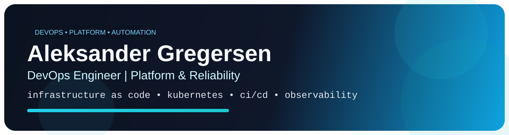

  

  

  
  
  
  

## About

Junior DevOps Engineer focused on reliability, developer experience, and automation.

- Building reproducible infrastructure and platform workflows that reduce manual ops.
- Improving CI/CD quality gates for safer and faster releases.
- Driving observability with metrics, logs, and dashboards that are actually actionable.

## Core Areas

| Area | What I work with |
|---|---|
| Platform | Docker, Kubernetes, NGINX |
| Infrastructure as Code | Terraform, Ansible |
| Observability | Prometheus, Grafana, Loki |
| Delivery | CI/CD pipelines, automated releases, container workflows |
| Engineering | TypeScript/Node.js, Java, Spring Boot |
| Frontend | React, React Native, Svelte |
| Data | PostgreSQL, MySQL/MariaDB, MSSQL, MongoDB, Redis, BullMQ |

## Featured Work

- **AI-search / Dynasearch**  
  Hybrid search platform with infrastructure, queueing, and observability baked in.

- **Medusa MCP tooling**  
  Admin automation and integration workflows focused on operational reliability.

## GitHub Snapshot

  
  

  

---

`Infra as code. Observable systems. Fast feedback loops.`
